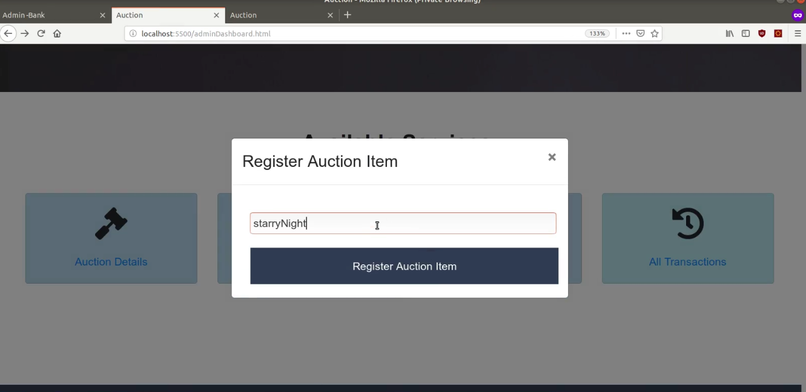
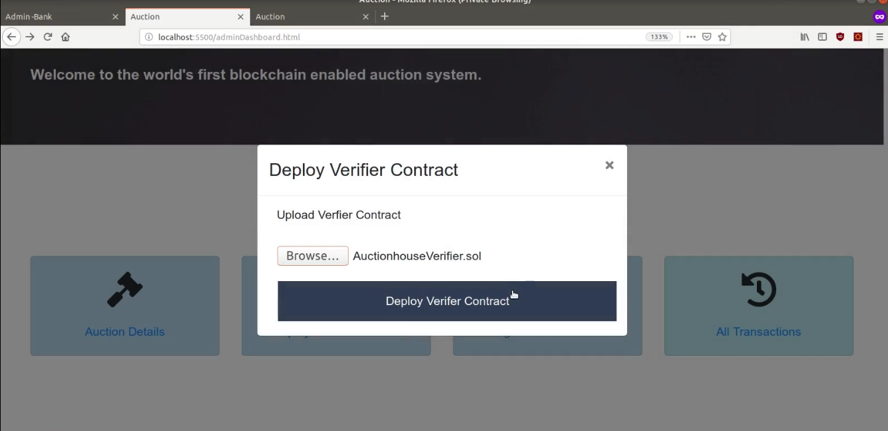
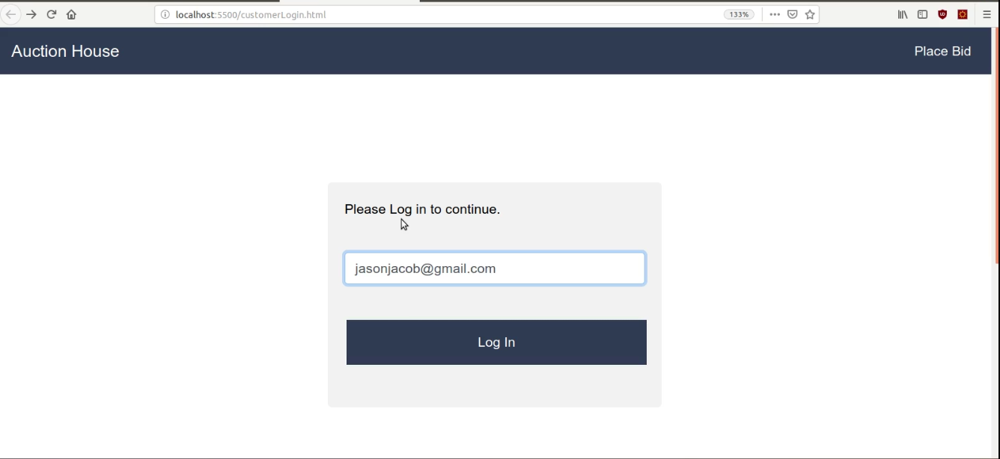
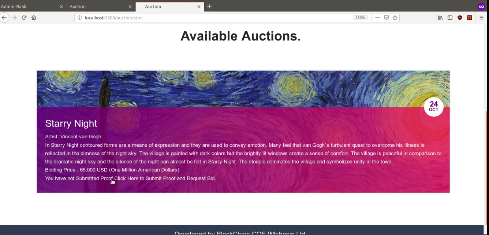
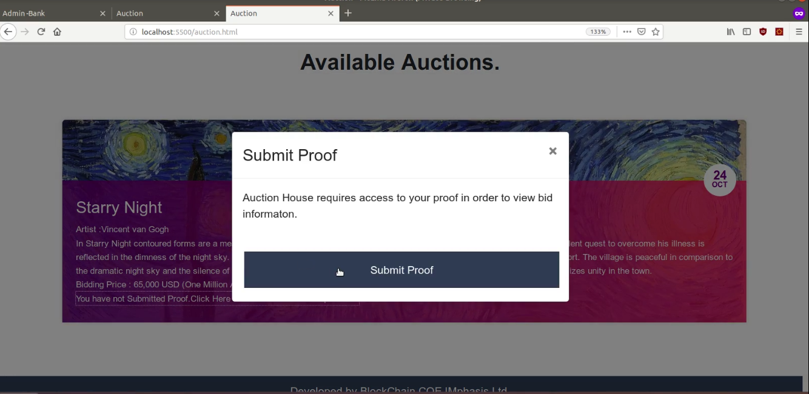
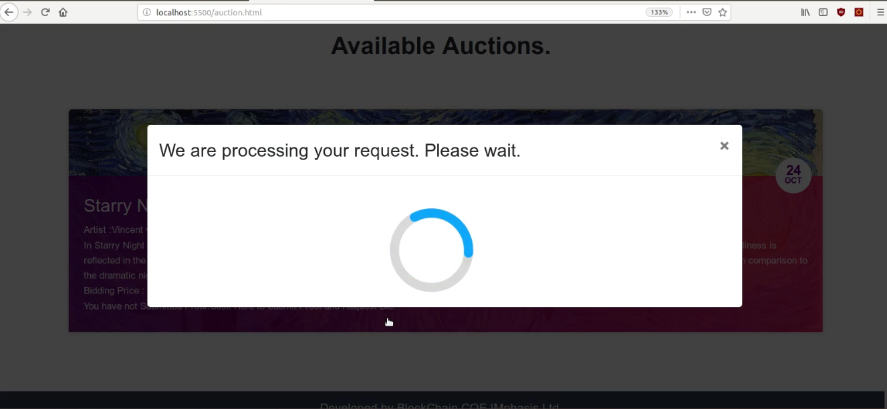
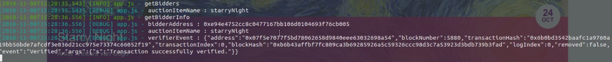
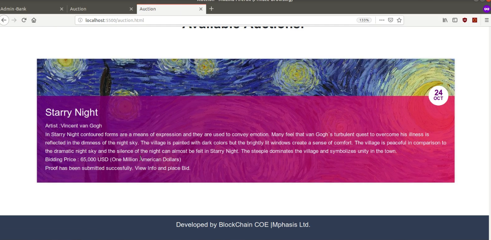

# Auctionhouse 

Auction house API for Auction house POC.

# Getting started

These instructions will get you a copy of the project up and running on your local machine.

# Prerequisites

> Install Nodejs version >= 8.10.0

> Install npm version >= 3.5.2

> Install ethereum composer ( https://mphasisblockchain@bitbucket.org/blockchainmphasisteam/ethereumcomposer.git)

> Setup and run ethereum chain.

> Install and start mongodb.

> Setup auctionhouse bank.


# Installing

### Clone the repository

```
$ git clone https://mphasisblockchain@bitbucket.org/blockchainmphasisteam/auctionhouse.git
```

### Install dependencies
```
$ cd auctionhouse
```
```
$ npm install
```

# Run API

> Default configuration of API can be changed in config.json file. The API listens at port 5500.

> Before deploying auction contract update the BalanceProofContract.json. Copy auctionhousebank/lib/DeployContract/BalanceProofContract.json to auctionhouse/lib/DeployContract/BalanceProofContract.json.

> Make sure that ethereum rpc API port and port in config.json are same.


### Deploy Auction contract

> Add ethereum wallet address and password instead of $walletAddress and $password. 

> Add RPC IP/Ip address(e.g. localhost/127.0.0.1 ) and RPC Port(e.g. 22002 ) instead of $RPCIP and $RPCPort.

> For more help execute --> $ node deployContract.js

```
$ cd lib/DeployContract
```

```
$ node deployContract.js Auction.sol Auction.json Auction 30000000 $walletAddress $walletPassword $RPCIP $RPPCPort AuctionContract.json
```

### Start the API

```
$ cd ../..
```

> Make sure that you are in the auction house project directory. Now run app.js.

```
$ node app
```

# Usage
> Access auction house portal at http://localhost:5500

### Register auction item




### Deploy verifier contract



### Customer login



### Proof submission








### Proof verification



